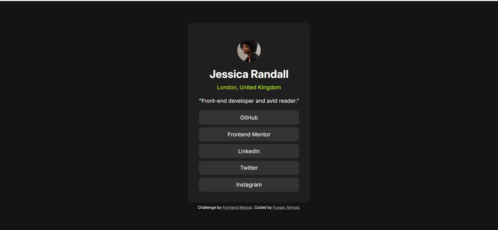

# Frontend Mentor - Social links profile solution

This is a solution to the [Social links profile challenge on Frontend Mentor](https://www.frontendmentor.io/challenges/social-links-profile-UG32l9m6dQ). Frontend Mentor challenges help you improve your coding skills by building realistic projects. 

## Table of contents

- [Screenshot](#screenshot)
- [Links](#links)
- [Built with](#built-with)
- [Author](#author)

### Screenshot

### Links

- Solution URL: [Here's the GitHub repo for this solution:](https://github.com/furqan7m3-ops/social-link-profile-main-html-css)
- Live Site URL: [Live Site URL:](https://social-link-profile-main-html-css.vercel.app/)

### Built with

- Semantic HTML5 markup
- CSS custom properties
- Flexbox
- CSS

## Author
- Frontend Mentor - [Furqan Ahmad](https://www.frontendmentor.io/profile/furqan7m3-ops)